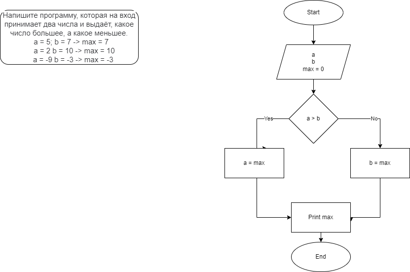
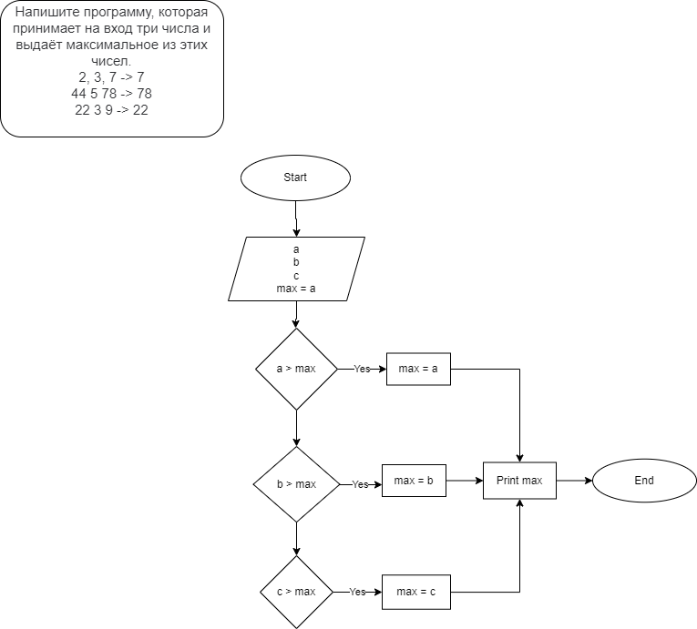

# Задача 2  (*Lesson1_1*)
## Условие ##
Напишите программу, которая на вход принимает два числа и выдаёт, какое число большее, а какое меньшее.

a = 5; b = 7 -> max = 7

a = 2 b = 10 -> max = 10

a = -9 b = -3 -> max = -3

*Блок-схема*

Внимание! В блок-схеме допущена ошибка. Считать max = a.

# Задача 4  (*Lesson1_2*)
## Условие ##

Напишите программу, которая принимает на вход три числа и выдаёт максимальное из этих чисел.

2, 3, 7 -> 7

44 5 78 -> 78

22 3 9 -> 22

*Блок-схема*

