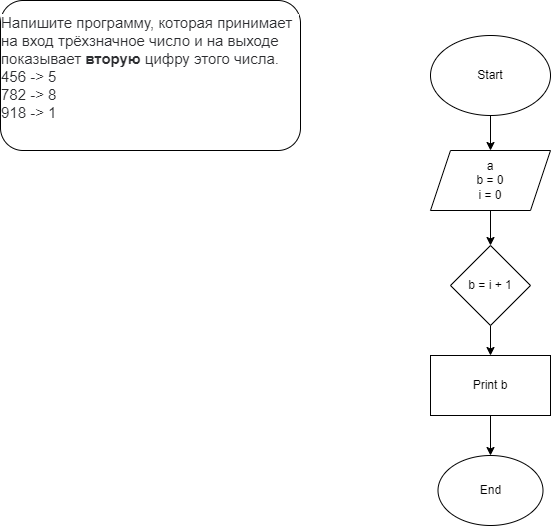

# Задача 10  (*Lesson2_1*)
## Условие ##
Напишите программу, которая принимает на вход трёхзначное число и на выходе показывает вторую цифру этого числа.

456 -> 5

782 -> 8

918 -> 1

*Блок-схема*

# Задача 10  (*Lesson2_2*)
## Условие ##

Напишите программу, которая выводит третью цифру заданного числа или сообщает, что третьей цифры нет.

645 -> 5

78 -> третьей цифры нет

32679 -> 6

*Блок-схема*

