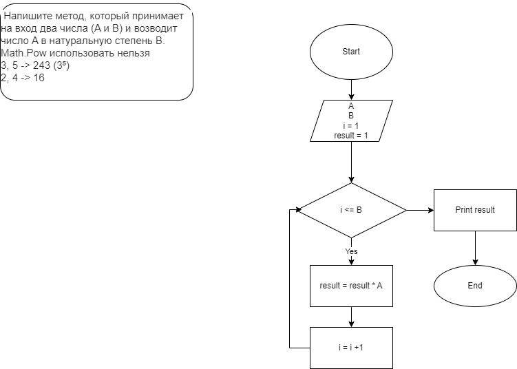

# Задача 25  (*Lesson4_1*)
## Условие ##
 Напишите метод, который принимает на вход два числа (A и B) и возводит число A в натуральную степень B.
Math.Pow использовать нельзя 

3, 5 -> 243 (3⁵)

2, 4 -> 16

# Задача 27  (*Lesson4_2*)
## Условие ##

Напишите метод, который принимает на вход число и выдаёт сумму цифр в числе.

452 -> 11

82 -> 10

9012 -> 12

# Задача 29  (*Lesson4_3*)
## Условие ##

Напишите методы, который задаёт массив из 8 элементов и выводит их на экран.

1, 2, 5, 7, 19 -> [1, 2, 5, 7, 19]

6, 1, 33 -> [6, 1, 33]